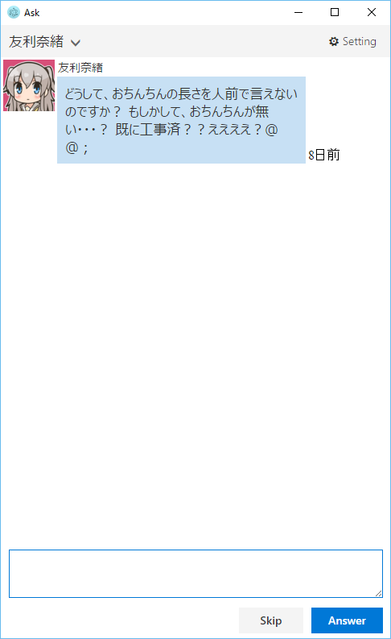

これは [友利奈緒 Advent Calendar 2015](http://www.adventar.org/calendars/779) の20日目の記事です。必死で未来から書いています。

# 友利奈緒とコミュニケーションするアプリ

のようなものを作りました。たぶん[この辺](https://github.com/tanakh/tomorinask)にソースを置くと思います。バイナリはたぶんもうしばらくしたら配布するかもしれませんが、こんなツール使いたいと思う人があんまりいない気がするので、配布しないかもしれません。

追記：バイナリ配布しました。使ってみたいという奇特な方は、<https://github.com/tanakh/tomorinask/releases>こちらからお試しください。

# 最近困っていたこと：Askリニューアル問題

ところで、[Ask.fm](https://ask.fm) という、どこからともなく質問がたくさんやってくる謎のサービスがあるのですが、このサイトが先日デザインをリニューアルしました。それはそれでいいのですが、大幅にリニューアルされてしまったせいで、僕にとっては大変使いづらくなってしまいました。

僕のアカウントには日ごろから結構たくさん質問をいただいていて、そのほぼすべてに「古い順に」回答を書いているのですが、これが非常に面倒くさい。

まずAsk.fmの質問一覧を表示させると、「最新」25件だけが表示されます。それより古い質問は、一番下までスクロールさせると自動的にリロードされて、末尾にアペンドされる形になります。質問が数百件たまっているときにこれをやろうとすると、まず一番古い質問を表示させるためにマウスのホイールを延々何十秒かくるくるし続けなければなりません。

そのあと質問にある「回答」ボタンをクリックすると、今度は回答画面に遷移します。回答画面に遷移して頑張って面白い回答をうんうん唸りながらタイプして、それから送信ボタンを押すと今度はまた質問一覧の画面に遷移します。そして質問一覧の画面に遷移するということは、当然また先ほどのよう何十秒かマウスをクリクリしなければならないわけです。一体自分は質問の回答をしているのか、マウスの耐久テストをしているのか、とでも言いたくなるほどに面倒極まるタスクの繰り返しで、Askを作っている人はこういう使い方で問題ないと考えているのか、あるいはこんなヘビーユーザーがいることを想定していないのか、はたまた質問はFIFOじゃなくてスタックで処理しろとおっしゃっているのか、いずれにせよ僕にはちょっとしっくりこない操作だったわけです。

まあ、このユーザーインターフェース自体は以前とたいして変わらないし、むしろ質問をする側の使い勝手としては、右側に常に質問ボックスが表示される仕様になったので、改善といえるものなのかもしれません。しかし以前のバージョンでは、Ask.fm使いづらいなあとぼやいていたら、親切なaskerの人がCtrl+Enterで投稿→自動で次の質問に移動するとても便利なChrome拡張を作ってくださったので、それでとても素晴らしいAskライフを送っていたのでした。それが、今回のリニューアルでまた以前の状況に逆戻りです。これではとてもじゃないけど、数百の質問をさばくことなんてできません。しかもアレですよ。僕にやってくる質問なんて半分ぐらいブリブリ！とかそんな感じでなので、頑張ってマウスホイールをクリクリクリクリ延々と転がして、それで出てきた質問が、

こんなふううにﾌﾞﾁﾐﾘだった暁には、もうウインドウ閉じて眠りたくなりますよ。

# そこで友利奈緒

そんなわけで僕のAskライフはとてもつらくなってしまいました。でも、変わらず質問を送ってくださる方はいらっしゃるので、それにお答えするのも使命ではあるなあと、重い腰を上げて使いやすいクライアントを作るか…となったわけです。そこで、せっかくだから、モチベを保つために、友利奈緒を導入することにしました。

どういうことかというと、Ask.fmにやってくる質問は大体が匿名質問なのです。だれが書いているかわからない質問だから、送信者を友利奈緒と思い込むことも可能だし、その可能性も実際にはまったくの0とは言えない。質問者を友利奈緒だと思い込むことによって、疑似的に友利奈緒とコミュニケーションしていると思い込むことも可能だし、そうすれば回答のモチベも多少上がるはず。加えて、プログラム書くモチベも上がるはず。

というわけで、こんなツールができました。イラストは[\@yaplus](https://twitter.com/yaplus)氏が配布されているものを使わせていただいています。ライセンス的に問題があったらすみません。消します。

ログインすると、友利奈緒から質問がやってきます。チャットアプリ風にしてみたので、某所のりんなちゃんのように楽しめるのではなかろうか？しかも書いてるのはAIじゃなくて生身の人間です。

しかし、質問がヒドいっ。

回答欄にタイプしてCtrl+Enterするだけで次々友利奈緒から質問が来るので、サクサク質問に答えられます。圧倒的に楽。スパムが来た時はSkipで回答を保留できます。全部質問を消化した後も定期的にポーリングしているので、取得し次第質問が表示されます。しかしこれ、もうちょっと友利奈緒とコミュニケーションしている感が出るかなあと思ったのですが、口調が全然違う質問ばかりだし、下品なのが結構多いので、実際のところ「友利奈緒はこんなこと言わない…」という感想にしかならないのが悲しかったです。

# メイキング

## Electron + GHCJS

ところでこのプログラムですが、最近流行りのElectronで実装してみました。ブラウザでデスクトップアプリなんて（困惑）とは頭ではそう思いつつも、触らずになんだかんだいうのも…ということなので、せっかくなので使ってみることにしました。

しかしElectronはともかく、JavaScriptを書くのは死んでも嫌でござる！と僕の深層心理が激しい拒否を訴えてくるので、JavaScriptは書きませんでした。今の世の中、JavaScriptをターゲット言語にできる言語処理系はたくさんあるんです。僕はHaskell愛好家なので、もちろんGHCJSを使いました。

Haskellの開発環境は、ちょうど今年[Stack](http://docs.haskellstack.org/)というツールの登場によってずいぶんいろいろと進展しました。僕も今年の夏ごろに記事を書いています（<http://qiita.com/tanakh/items/6866d0f570d0547df026>）。

その進展の一つに、Stackを使うとGHCJSがものすごく簡単にセットアップできるというのがあります。今まではまずGHCJSのコンパイルとセットアップが結構面倒でこの時点で、もういいや…となってしまいそうなぐらいでしたが、今ではstackの設定ファイルに一つ設定を追加するだけです。`stack new`でGHCJS向けのプロジェクトテンプレートが生成できるし、あとは`stack build`コマンドでHaskellのコードがコンパイルされて.jsファイルが出来上がります。一昔前が信じられないぐらい楽ちんですね。

それから、Electronのサイトをみて、最初のサンプルを拾ってきます。あとは index.html から出来上がったjsファイルを読み込ませるだけです。これだけでHaskellでElectronアプリが書けました！

このあたりの詳細な手順も書き残しておこうと思うので、近いうちに詳しい記事を書こうと思います。

HaskellからJavaScriptを生成できるとはいえ、DOMをいじらなければブラウザのアプリにはならないので、そこの辺りはライブラリの話になります。当然のことながら、GHCJS向けのライブラリはほとんどまともに存在していないのですが、かろうじて[ghcjs-dom](https://hackage.haskell.org/package/ghcjs-dom)というDOM操作ライブラリはちゃんと作られていたので、今回はまったくJavaScriptへのFFIを手で書かずにすみました。とはいえGHCJSではJavaScriptのFFIもそんなに大変だというわけではないのですが。

## Haskellで書いてうれしかったこと

HaskellでWebアプリを書くことに関しては、気づいただけでいくつかはっきりとしたメリットがありました。一つは、きっちりとした型がついていること。特にDOMのAPIに関しては、まったく知識がなかったにもかかわらず、APIのドキュメントを読むだけで特にはまることなく使い方も悩むことがなかったです。ただ一つ難を言えば、ドキュメントがでかいのと、Haddockの生成するHTMLがモジュールをまたいでいろいろ参照するのに便利にできてないので、結構閲覧がめんどかったということでしょうか。

別の利点としては、結構な数のHaskellのライブラリがGHCJSでそのまま動くということ。今回のケースでは[parsec](http://hackage.haskell.org/package/parsec)や[aeson](http://hackage.haskell.org/package/aeson)のような強力なパージングライブラリがつかえたことが大きかったです。そもそもJSONやHTMLをネイティブに扱えるJavaScriptでHaskellからコンパイルしたコードで自前でパーズするのがなんだかとても無駄な気もしますけど、もっと別の用途を考えると、可能性は感じました。

もう一つは、マルチスレッドコードが書けること。スレッドを立ててブロッキングで処理して、セマフォを使ってデータを受け渡しのようなコードがすっきり書けます。JavaScriptでは（ES6だとasync/awaitなどが入るようですが）コールバックが前提で、コードがわかりづらくなりやすいようですが、そういうのをまったく回避して、直接的なコードフローで見通しの良いコードが書けます。このアプリだと、質問を取得しているスレッドと、ユーザからの入力を待っているスレッドがあって、これらのスレッドがチャンネルを介して質問オブジェクトを受け渡ししています。

## Electron所感

Electronでデスクトップアプリを作ることに関しては、まあ何でしょうか。レイアウトなどは相変わらずしんどいのですが、HTML/CSSに関する情報はあまりにも世の中にたくさんありすぎます。Googleで検索してわからないことなどまずないでしょう。Webデザインなどほとんどやらない僕でも、なんかそれっぽい画面を作れてしまうのは、やっぱりHTMLだなあと思いました。WPFとかQtとかだとこうはいかない。なんだかちょっとつらいところはありますね。

# おわりに

そういうわけで、久々にGUIアプリを書いてみたのですが、結構やってみると面白いものですね。なんかネタを探してもっと何か作りたくなってきました。あと記事遅くなって申し訳ありませんでした。
