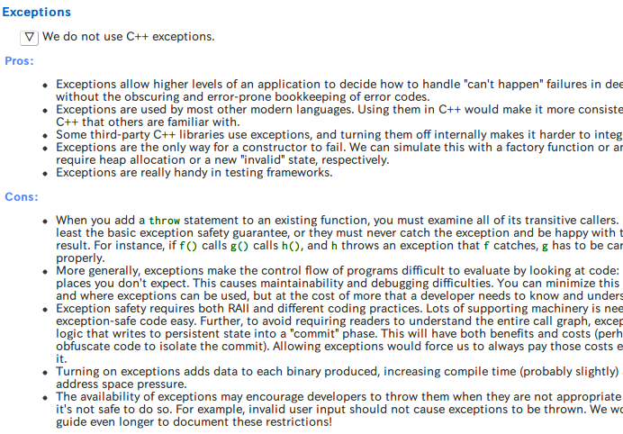
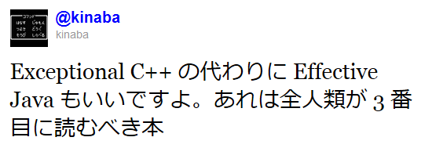

% エラー処理の抽象化
% 田中英行 <tanaka.hideyuki@gmail.com>
% 2012/06/26 @[LOG.debug("nice catch!")](http://connpass.com/event/607/)

## 自己紹介

* 田中英行 <http://tanakh.jp>
* Twitter: @[tanakh](http://twitter.com/tanakh)
* Github: <https://github.com/tanakh>

* [Preferred Infrastracture](http://preferred.jp/) 勤務のプログラマ
    * Haskellと、プログラミングについてあれこれ考えるのが好き

* Haskell入門書 [すごいHaskellたのしく学ぼう! ](http://www.amazon.co.jp/gp/product/4274068854?ie=UTF8&camp=1207&creative=8411&creativeASIN=4274068854&linkCode=shr&tag=peropero0b-22&creativeASIN=4274068854&redirect=true&ref_=nosim)

    * [Learn You a Haskell for Great Good!](http://learnyouahaskell.com/) の和訳
    * <iframe src="http://rcm-jp.amazon.co.jp/e/cm?lt1=_blank&bc1=000000&IS2=1&bg1=FFFFFF&fc1=000000&lc1=0000FF&t=peropero0b-22&o=9&p=8&l=as4&m=amazon&f=ifr&ref=ss_til&asins=4274068854" style="width:120px;height:240px;" scrolling="no" marginwidth="0" marginheight="0" frameborder="0"></iframe>

## java-ja …！？

とんでもないところに来てしまったぞ (((´･_･`))) ﾌﾞﾙﾌﾞﾙ

## 本日のお話

* なぜ、エラー処理は重要なのか？
* なぜ、エラー処理の抽象化は重要なのか？
* なぜ、エラー処理の抽象化は行われて来なかったのか？
* エラー処理をどう抽象化するのか

# エラー処理とは何なのか

## エラー処理は好きですか？

 
 
 
 
 
僕は嫌いです

## そんなあなたのために

あわせて読みたい：[エラー処理を書いてはいけない](http://tanakh.jp/pub/pfi-seminar-2011-12-08.html)

<iframe src="http://tanakh.jp/pub/pfi-seminar-2011-12-08.html"></iframe>

## エラー処理

時々刻々と発生し続けるエラーに華麗に対処しつつ、
何事もなかったかのように動き続ける
堅牢なソフトウェアを作るための処理。

※ そういうソフトウェアである必要がなければ、
必ずしもきちんとやる必要はない

* 単機能のコマンドラインツール

    * ⇒ 落ちて終了（処理系がなんかそれっぽい情報出すんでそれでおｋ！）
    * （エラーのまま実行続行はさすがにまずいんで、さすがに無視はできないけれども…）

## エラー処理はなんで必要なのか？

<q>プログラムに おかしなものは 憑き物だ</q>

阿良◯木暦

## あなたのそばに這い寄るエラー

* ハードウェア由来

    * 無線ネットワークが切れた
    * ディスクが壊れた

* 不正な引数

    * 存在しないファイル名でファイルを開いた
    * メールアドレス渡すところに名前渡した

* 呼び出し先の問題

    * タイムアウト
    * HTTP 503

* 単なるバグ

    * ぬるぽ, assertion failure, などなど

## エラー処理は面倒・難しい

* エラー処理は面倒

    * エラー処理は単純作業

* エラー処理は難しい

    * エラー処理を正しく行うのは神経を使う作業

面倒…難しい……！？

## ！？

そうだね、抽象化だね。

<q>Don't repeat yourself</q>

Andy Hunt, Dave Thomas

# エラー処理と例外

## エラー処理

エラー処理には次の2つが必要。

* エラーの通知

    * エラーが発生した時に、それを正しく伝える

* エラーの受信

    * 呼び出し先がエラーを通知した時に、それを適切に処理する

## エラー通知の手段（代表的なもの）

* int型の返り値
    * C言語のAPI

* Nullableな返り値
    * fopen, java.util.Map.get(), HaskellのMaybe

* 返り値とエラー情報のタプル
    * Goのライブラリなど

* 返り値とエラーの直和型
    * HaskellのEitherなど

* オブジェクトをエラー状態にする
    * STLのstreamクラスなど

* 例外を投げる
    * Javaのライブラリ、その他近代的なものほとんど

## intでエラーを返す

~~~ {.c}
int foo(...)
{
  int fd = open(...);
  if (fd < 0) return -1;
  int fe = open(...);
  if (fe < 0) {
    close(fd);
    return -1;
  }
  int ff = open(...);
  if (ff < 0) {
    close(fe);
    close(fd);
    return -1;
  }
  ...
}
~~~

## intでエラーを返す

~~~ {.c}
int foo(...)
{
  int fd = open(...);
  if (fd < 0) return -1;   // <- エラー処理
  int fe = open(...);
  if (fe < 0) {            // <- エラー処理
    close(fd);             // <- エラー処理
    return -1;             // <- エラー処理
  }                        // <- エラー処理
  int ff = open(...);
  if (ff < 0) {            // <- エラー処理
    close(fe);             // <- エラー処理
    close(fd);             // <- エラー処理
    return -1;             // <- エラー処理
  }                        // <- エラー処理
  ...
}
~~~

## 利点と欠点

* 利点

    * プログラミング言語の表現力を必要としない

* 欠点

    * 返り値をエラーに取られる (返り値は何とかして別の手段で受け取る)
    * 関数を合成しにくくなる（C言語では関係ないけど）
    * エラーをいとも簡単に無視できてしまう（無視する手間 << 処理する手間）
    * エラーの情報を渡しにくい
    
        * グローバル変数経由（スレッドセーフティに影響）
        * intにエラー情報をエンコード
        * オブジェクトにエラー情報持たせる（STLとか）

## 利点と欠点

* 欠点（続き）

    * エラー処理に比較的多くのコードが割かれる
    * エラー処理が通常のコードが密接に混ざり合う
    * しばしば非常に煩雑なコードになるので、
      コードが正しいか判別するのが難しくなる
    * リソースの後始末のためにgotoがしばしば必要になる

    ~~~ {.haskell}
       ＿人人人 人人人＿
       ＞ 突然のGoto論争 ＜
       ￣Y^Y^Y^Y^Y^Y^Y￣ 
    ~~~

## 例外を用いたエラー処理

~~~ {.java}
class Main {
  public static void main (String[] args) {
    try {
      int x = 1/0;
      ...
    } catch (ArithmeticException e) {
      // error handling...
      ...
    }
  }
}
~~~

## 利点と欠点

* 利点

    * 例外を無視しづらい（明示的に握りつぶしか）
    * 例外処理のコードが分離される

* 欠点

    * 後述

## 例外を用いたエラー処理

http://www.atmarkit.co.jp/fjava/javatips/166java051.html

## ん…？

<iframe src="http://connpass.com/event/607/"></iframe>

## エラー通知として何を利用するか？

* 意外とセンスが問われる！

    * 未だに、どうやってエラー通知をするか揉める
    * 例外を使おうよ社内勉強会やったり
    
        * C++で例外を使おうと思ったら大変

* プログラミング環境からくる制約もある

## プログラミング言語の表現力・思想に影響される

* 例えば、C言語には例外のための十分な言語機能がない

* 例外が使えたとしても、利用したいソフトウェア・ライブラリが
  例外安全じゃないなど

* 推奨するエラー通知手段を扱いやすく言語を設計する

    * タプルがでエラー処理するために、
      それを扱いやすくしたGoとか

### 例外使うべからず？

割りと影響力のある[Google C++スタイルガイド](http://google-styleguide.googlecode.com/svn/trunk/cppguide.xml)が
例外を禁止している

http://google-styleguide.googlecode.com/svn/trunk/cppguide.xml?showone=Exceptions#Exceptions

## 例外安全性

例外を用いた正しいコードを書くのは大変。

守るべきガイドラインを、例外安全性としてまとめた

詳しくはこちら → <http://togetter.com/li/227690>

* 死ぬほどむずい！

    * 実はライブラリのインターフェース設計にも影響を及ぼす

## STLのstack::pop()の返り値がvoidだ問題

* stack::pop() が値を返せない問題

    * 例外安全な！

* Exceptional C++ (ハーブ サッター)に詳しい

    * その他、C++の罠がたくさん載っている楽しい本
    
        <iframe src="http://rcm-jp.amazon.co.jp/e/cm?lt1=_blank&bc1=000000&IS2=1&bg1=FFFFFF&fc1=000000&lc1=0000FF&t=peropero0b-22&o=9&p=8&l=as4&m=amazon&f=ifr&ref=ss_til&asins=4894712709" style="width:120px;height:240px;" scrolling="no" marginwidth="0" marginheight="0" frameborder="0"></iframe>

## 全人類が知るべき問題

## ※注意

一般に、スタックの`pop`を例外安全に書けないという話ではない

あくまで、C++のセマンティクスで、STLの標準ライブラリの仕様を満たしつつ、
*強い例外安全* が実現できないという話

(cf. `java.util.Stack<E>`)

* エラー処理の抽象化を可能とするための道具

    * GCがあれば、例外安全で考えなければいけないことがかなり減る
    * その他、using(C#), try-with-resources(Java7), RAII的なツール等

## まあ

* 例外もあんまりいいことばかりではない

## コントロールフロー的批判

* 例外は大域脱出でgotoみたいなものだから良くない
    * コントロールフロー追えない

* そもそもコントロールフローは追わずに済ますべき
    * 例外を使わない場合でも、
      相当するものを手で書いているに過ぎない
    * 最終的にはどうせ把握できなくなる
      （あるいは、超人にしか把握できなくなるし、そんな超人にはなりたくないし）

* マルチスレッドとか絡んでくるともっとよくわからなくなる
    * 安全に組み合わせることのできるビルディングブロックを例外に持ち込みたい
    * コンビネータと、その正しい結合法則 → 正しいプログラムしかありえない

## 適材適所

* エラー通知は、一概に何がいいとも言えない
    * あるところはNullableがいいし、別のところでは例外がいいかもしれない
    * 適切な場所で適切なエラー通知方式を選択したい

* でも、そういうわけにもいかない
    * 一般にはエラー通知手段に対して、
      それに対応するエラー受信コードを書かなければいけない
          * NullableならNullチェック、例外ならcatch
    * エラー処理が正しいかどうかが、余計煩雑に…

じゃあどうすればいいの (´･_･`)…？

# エラー処理の抽象化

## エラー送出の抽象化

* エラーを投げる → コンテクストに応じたエラーに変化

    * int が求められてる時には int を返す
    * Either が求められてる時には Either を返す
    * はたまた、例外が求められていれば、例外を投げる

* そんな事出来るんですか (´･_･`)？

    * それは後ほど

## エラー受信の抽象化

* エラーの受信に係るコードの抽象化

* エラーコード、例外、その他もろもろ統一的に扱えるポリモーフィックなハンドラ

* 重要なのは Composability (組み合わせ可能性)

    * 正しいプログラムAとBを組み合わせたものもまた正しい
        * 一般に命令型プログラミングではあまり重要視されない
    * 関数プログラミングの文脈では、
      コードの設計で最重要視するべきこと！
      （エラー処理に限らない）

* 組み合わせ可能な、抽象化されたエラーハンドラ

    * これがゴール

## 実現に必要なもの

* 必要なビルディングブロック

    * エラーの送出
    
        * エラーを通知するのにもちろん必要
    
    * エラーの伝搬
    
        * 下で起こったエラーを必ず確実に上に伝える
    
    * bracket (a.k.a dynamic-wind @scheme)
    
        * 初期化、後始末、本体処理の3つの処理を受け取る
        * 本体でエラーが起きた場合も後始末処理が確実に実行される
        * エラー処理コード同士を組み合わせるのに必要

## ビルディングブロック

* ビルティングブロックの組み合わせは、いろいろ考えられる

    * bracketの代わりにtry（と同等の関数）とか
    * いずれにせよ、Composabilityを考えなければいけない

## どうやって実現するんですか？

では、お見せしましょう。

# Haskellでの例

## 幾つかのエラー処理フレームワーク

モナドを使えば出来るよ！

* mtl: MonadError
* failure
* monad-control
* lifted-base

## おおまかな説明

* フレームワークがビルティングブロックを定義

* 各エラー方式でそれを実装

* あとは組み合わせ自由自在

## Error モナド (in mtl)

~~~ {.haskell}
class (Monad m) => MonadError e m | m -> e where
    -- | Is used within a monadic computation to begin exception processing.
    throwError :: e -> m a

    {- |
    A handler function to handle previous errors and return to normal execution.
    A common idiom is:

    > do { action1; action2; action3 } `catchError` handler

    where the @action@ functions can call 'throwError'.
    Note that @handler@ and the do-block must have the same return type.
    -}
    catchError :: m a -> (e -> m a) -> m a
~~~

（`throwError`と`catchError`という関数が定義されている）

## Error モナド

IO例外を扱えるようにする

~~~ {.haskell}
instance MonadError IOException IO where
    throwError = ioError
    catchError = catch
~~~

Eitherを扱えるようにする

~~~ {.haskell}
instance Error e => MonadError e (Either e) where
    throwError             = Left
    Left  l `catchError` h = h l
    Right r `catchError` _ = Right r

instance (Monad m, Error e) => MonadError e (ErrorT e m) where
    throwError = ErrorT.throwError
    catchError = ErrorT.catchError
~~~

## 例

~~~ {.haskell}
ghci> throwError "hoge" :: Either String ()
Left "hoge"
ghci> throwError "hoge" :: Maybe ()
Nothing
~~~

## エラーの抽象化 → エラーハンドラパターンの抽象化

よくあるパターンを抽象化できるようになる

* エラー無視

* n回試行

* a が失敗したら b を実行

これらを組み合わせて、

* aかbのダウンロードが成功するまで10回繰り返して、
  失敗したエラーは無視して（もしくはログに出して）
  終了するHTTPクライアント、とか

## 抽象化：エラー無視

~~~ {.haskell}
ign :: MonadError e m => m () -> m ()
ign m = m `catchError` (\e -> return ())
~~~

受け取ったエラーを無視するだけのコード

## 抽象化：n回試行

~~~ {.haskell}
tryN :: MonadError e m => Int -> m a -> m a
tryN n m = go n where
  go 1 = m
  go i = m `catchError` (\e -> go (i-1))
~~~

失敗したらカウンタを減らして再度実行

## 抽象化：aが失敗したらbを実行

~~~ {.haskell}
or :: MonadError e m => m a -> m a -> m a
or a b = do
  a `catchError` (\_ -> b)
~~~

エラーハンドラでbを実行する

## 組み立てる

~~~ {.haskell}
main = ign $ tryN 10 $ do
  download "http://xxx/aznn.png" `or`
  download "http://xxx/prpr.png"
~~~

あんなコードやこんなコードも自由自在！

# extra contents

## エラー処理とリソース管理

* エラー処理とリソース管理は切っても切れない関係

    * エラーハンドラの行う処理のうち、最も重要な一つ

* リソース管理の抽象化も必要

    * RAIIと呼ばれたりするものもその一例
    * これがない場合の悲劇は先程のJavaのコードを参照

## エラー処理と並行処理

* 排他処理、ロックなど慎重を極める

    * 非常に難しい問題
    * すべての並行Javaプログラムにはバグっているか、
      あるいはまだ見つかっていないバグがある 
        ーJava並行処理プログラミング
    * 排他処理の解決策と組み合わせ
        * STM, メッセージパッシング、immutable

* 非同期例外

    * あるスレッドが別のスレッドに例外を投げられる
    * いついかなる時でも、例外が飛んでくるようになるので、
      それに備えたコードを書くことが必要になる
    * ビルディングブロックに、**"例外マスク"**の追加が必要

## 例外マスク

* `mask :: ((forall a. IO a -> IO a) -> IO b) -> IO b`

使用例：

~~~ {.haskell}
mask $ \restore -> do
     x <- acquire
     restore (do_something_with x) `onException` release
     release
~~~

引数の処理は非同期例外がマスクされる。
ただし、引数（ここでは`restore`）を用いれば、
マスクを解除できる。

## OO言語での実現

* これまでの抽象化は、高階関数ベースの話

* OO言語では、どういう風に抽象化すればうまくいくのか解らない

    * Scalaだと同じようなのできそうですが…

* 皆様是非（Javaで！）考えてみてください！

# まとめ

## まとめ

* エラー処理は抽象化できる

* エラー処理を抽象化すると

    * 退屈な繰り返しを避けられる
    * 適切なエラー通知手段を選べる
    * エラー処理が簡潔かつ確実になる！

 
 
 

Thank you for listening!

